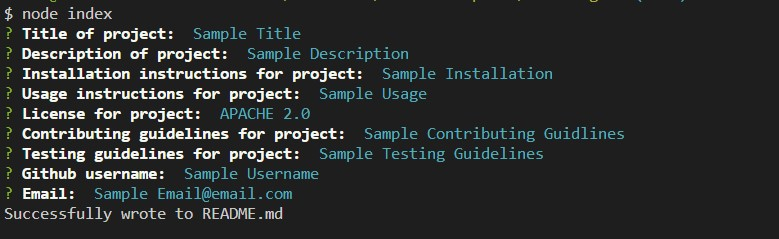

# README Generator

A intuitive readme generator using node.js in the terminal to go through a list of prompts to automatically generate a README.md file filled with the users input

<a href="https://drive.google.com/file/d/1iv4tvFrJUkmqhr9P2TTzVKNNLTVh4--h/view">Demo Link</a>